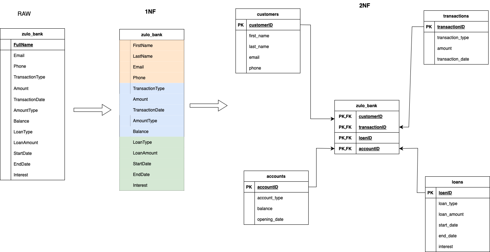
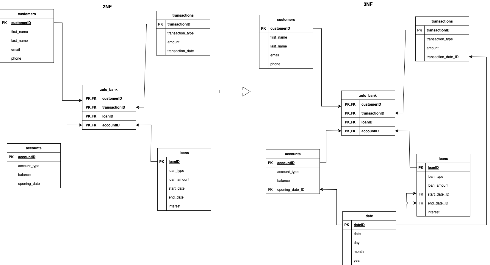
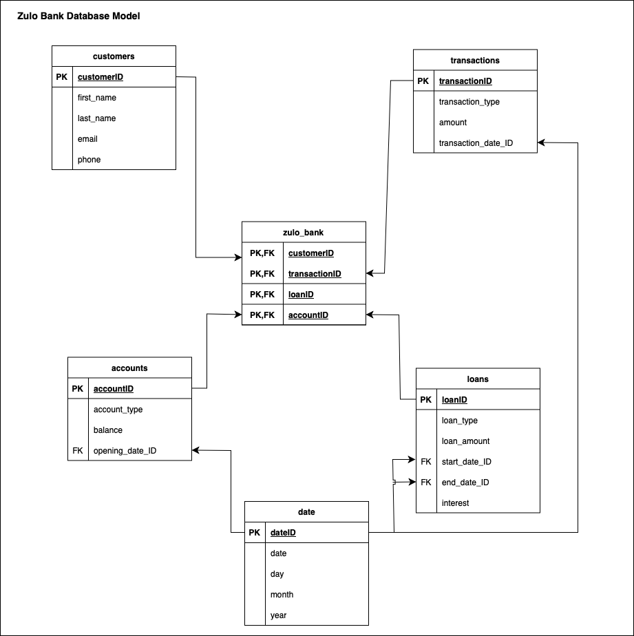
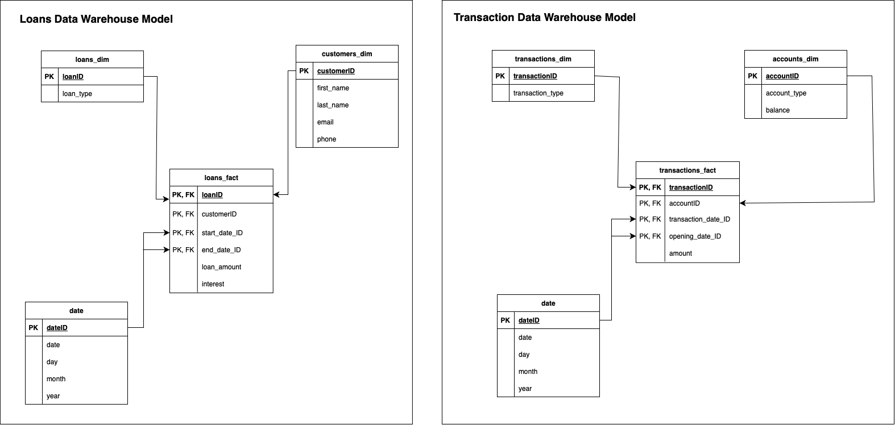

The methodical approach to database modelling involves multiple steps, starting with the analysis of the given dataset and progressing through design, normalization, and implementation especially when working with a denormalized datasets like the Zulo bank dataset provided.

# The Normalization process 

The goal of normalization is a way to simplify the data , by removing repeated data , dividing into simple tables and columns for effective query and optimization. It removes redundancy and increase efficiency

### The First Normal Form 

* 1NF was achieved by atomizing the dataset
* 2NF broke the dataset into different unique tables
* 3NF was acheived by creating a new date table

##

##
### The Database Model 

##

## The Data Warehouse Model

Due to the business requirement, two fact tables were considered for Zulo Bank

### Fact Table Consideration:

##### Loans Fact Table:
* Could include LoanID, CustomerID (as a foreign key to the Customer dimension), start_date_id, end_date_id (as foreign keys to the Date dimension), and metrics like LoanAmount and interest.

##### Transactions Fact Table:
* Could include TransactionID, AccountID (as a foreign key to the Account dimension), date_id (as a foreign key to the Date dimension), and measurable metrics like Amount.

